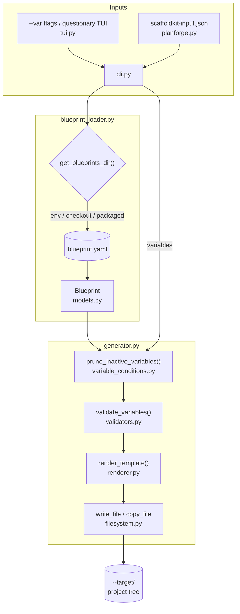

# ScaffoldKit

AI-aided project scaffolding from declarative blueprints.

ScaffoldKit generates complete project skeletons (source layout, docs, ways-of-working, ADRs, page templates, AI context files) from a folder of YAML blueprints plus Jinja2 templates. It is the scaffolding engine behind [project-forge](https://github.com/LanNguyenSi/project-forge) and consumes the `scaffoldkit-input.json` export from [agent-planforge](https://github.com/LanNguyenSi/agent-planforge), so blueprints written here flow straight into both downstream tools.

## How it works

ScaffoldKit routes every invocation through a four-stage pipeline: input resolution, blueprint loading, generation, and file output.



## Try it in 60 seconds

```bash
git clone https://github.com/LanNguyenSi/scaffoldkit.git
cd scaffoldkit
./install.sh

# generate a CLI tool skeleton from the cli-tool blueprint
scaffoldkit new cli-tool \
  --target ./hello-cli \
  --non-interactive --yes \
  --var project_name=hello-cli \
  --var display_name="Hello CLI" \
  --var description="A demo CLI"
```

Don't want Python on your host? Use `./install.sh --docker` instead. See [docs/cli.md](docs/cli.md#installation) for every install path.

## What you get

```
Generation completed successfully!

Files created (15):
  README.md
  pyproject.toml
  .github/workflows/ci.yml
  docs/architecture.md
  docs/ways-of-working.md
  docs/adrs/0001-architecture.md
  AI_CONTEXT.md
  src/__init__.py
  src/main.py
  src/commands/__init__.py
  src/commands/run.py
  tests/__init__.py
  tests/test_run.py
  .editorconfig
  .gitignore

Directories (6):
  hello-cli/
  hello-cli/src
  hello-cli/src/commands
  hello-cli/src/config
  hello-cli/tests
  hello-cli/docs/adrs
```

`AI_CONTEXT.md` and the `docs/` set are the point: every blueprint ships ways-of-working, an architecture doc, and an ADR seed so a downstream Claude Code or Cursor session has real context from minute one. Run `scaffoldkit list` to see all 12 blueprints.

## Next steps

| If you want to... | Read |
|------|------|
| See every blueprint, its variables, and the YAML/Jinja format | [docs/blueprints.md](docs/blueprints.md) |
| Pipe an agent-planforge export into `scaffoldkit from-planforge` | [docs/planforge-integration.md](docs/planforge-integration.md) |
| Understand how generation works (loader, renderer, filesystem) | [docs/architecture.md](docs/architecture.md) |
| Full CLI reference (`new`, `from-planforge`, `init-blueprint`, `list`) | [docs/cli.md](docs/cli.md) |

## Used by

- [project-forge](https://github.com/LanNguyenSi/project-forge), end-to-end project bootstrapper that invokes ScaffoldKit for blueprint generation.
- [agent-planforge](https://github.com/LanNguyenSi/agent-planforge), planning tool whose `scaffoldkit-input.json` export feeds directly into `scaffoldkit from-planforge`.

Both depend on this repo in production. Changes to blueprint contracts here ripple into those consumers.

Because agent-planforge's `server/Dockerfile` pins ScaffoldKit to a fixed commit SHA (`SCAFFOLDKIT_REF`), every merge to `master` here auto-opens a `chore(deps): bump scaffoldkit to <sha7>` task in agent-planforge's agent-tasks project (see `.github/workflows/notify-planforge.yml` and `scripts/notify-planforge.sh`). This keeps the drift between ScaffoldKit's default branch and the pinned SHA visible instead of silent (live since 2026-08-18, secret provisioned); the task carries the compare URL, the changed files, and a re-pickup checklist for whoever bumps the pin.

**Provisioning the notification.** The workflow no-ops (green, with a visible `::notice::`) until the operator provisions the bot token:

```bash
gh secret set PLANFORGE_BOT_TOKEN --repo LanNguyenSi/scaffoldkit
```

The token needs `tasks:create` scope to open the bump task, and `tasks:update` scope to respec (supersede) an older open bump task when a newer commit lands before the previous one was picked up. The bot identity also needs membership on agent-planforge's agent-tasks project: project access is enforced independently of token scopes, so a correctly-scoped bot that isn't a project member gets a 403 "No project access" on the very first call and the workflow goes red. Supersede is best-effort: the bot can only respec tasks it created itself by default (creator-only respec is the agent-tasks default; whether agent-planforge's project overrides that via `allowNonCreatorRespec` has not been verified against the live project config), so if the previous bump task was filed by a human or a different identity, the respec attempt fails quietly (logged as a warning) and the new task is still created.

After provisioning the token and project access, verify the first push to `master` shows a green "Notify Planforge" run in Actions.

## Development

```bash
make dev              # create .venv with dev deps
source .venv/bin/activate
make check            # run lint + typecheck + test
```

Or directly:

```bash
pytest                                              # tests
pytest --cov=scaffoldkit --cov-report=term-missing  # coverage
ruff check src/ tests/                              # lint
ruff format src/ tests/                             # format
mypy src/scaffoldkit/                               # type check
```

CI runs lint, mypy strict, pytest on Python 3.11/3.12/3.13, and a build+install verification on every push and PR to `master`.

See [CONTRIBUTING.md](CONTRIBUTING.md) for development setup, coding standards, and PR process. Release history lives in [CHANGELOG.md](CHANGELOG.md).

## License

MIT, see [LICENSE](LICENSE).
